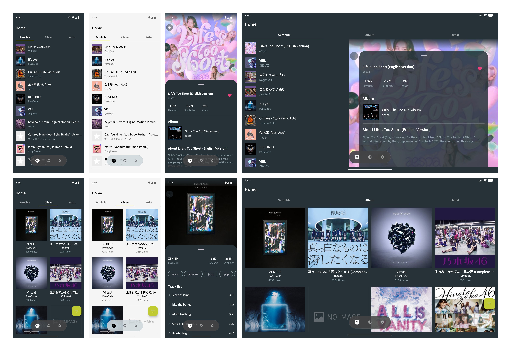
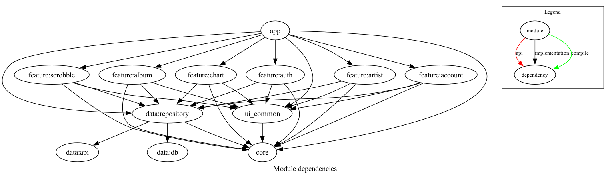

## SunsetScrob

Last.fm client on Android (mainly for my portfolio)

- - -




See more: [screenshots](./screenshot/README.md)

## Features

- Show latest scrobbles
- Show top albums
- Show track content details
- Show album content details
- Filter top albums by time range
- Show top artists
- Filter top artists by time range
- Update NowPlaying and Scrobbling (for Apple Music, Spotify, and YouTube Music only)
- Switch themes
- Autofill
- Themed icon

## How to try

Prepare local.properties and run `./gradlew installDebug`

```
API_KEY=YOUR LAST.FM API KEY
SHARED_SECRET=YOUR LAST.FM SHARED SECRET
```

- - -

or try via Google Play

## Libraries and tools

- Jetpack Compose
- Kotlin Coroutines
- Ktor client
- Coil
- Gradle version catalog
- Gradle convention plugin
- fastlane
- Kotest

## Quality

Conventions are encoded as executable specs and enforced at the CI boundary,
so any change is verified the same way before it lands.

| Category     | Tool / Module                      | Trigger   |
|--------------|------------------------------------|-----------|
| Unit         | Kotest + MockK                     | push / PR |
| Architecture | Konsist (`:architecture-spec`)     | push / PR |
| Lint         | Android Lint                       | push / PR |
| Custom Lint  | `:lint-checks` (project detectors) | push / PR |
| VRT          | Roborazzi screenshot tests         | push / PR |
| E2E          | Compose integration tests          | weekly    |
| Compose perf | Compose compiler metrics           | weekly    |
| Startup perf | Macrobenchmark                     | weekly    |

### Architecture spec

`:architecture-spec` is a Konsist sensor module. Each rule under
`.claude/rules/` is paired with a `*ArchitectureSpec.kt` test, so violations
of module-graph and layering rules fail the build. Examples:

- `:feature:*` must not depend on `:data:api` / `:data:db` directly
- Feature-to-feature dependencies are forbidden, except `:feature:home`
  which acts as the navigation hub
- Repositories must return `Flow`
- Every rule doc under `.claude/rules/` is paired with a Spec — guide and
  sensor stay in sync by construction

### Android Lint

Lint runs with AGP defaults plus targeted disables in
`AndroidLintConfiguration` (`build-logic/convention/.../ext/`). It fails the
build only when `CI=true` — locally, issues surface via reports and IDE
highlights. Project-specific rules are implemented as custom detectors in
`:lint-checks`, registered through the Compose convention plugin so every
Compose module picks them up:

- `@Preview` composables must be `private`
- `UiState` must be `@Immutable` and exposed as `StateFlow`
- Use the project's `Sunset*` wrappers instead of Material3 primitives directly
  (`SunsetText`, `SunsetButton`, `SunsetTopAppBar`, …)

Lint failures break CI on PR, and a summary is auto-posted as a PR comment.

<details>
<summary> module graph </summary>



</details>
