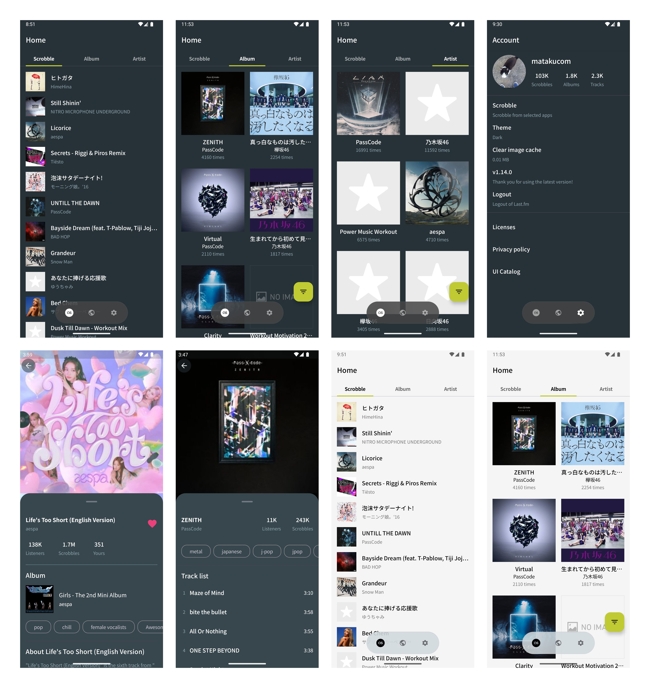

## SunsetScrob

Last.fm client on Android (mainly for my portfolio)

- - -




See more: [screenshots](./screenshot/README.md)


## Features

- Show latest scrobbles
- Show top albums
- Show track content details
- Show album content details
- Filter top albums by time range
- Show top artists
- Filter top artists by time range
- Update NowPlaying and Scrobbling (for Apple Music, Spotify, and YouTube Music only)
- Switch themes
- Autofill
- Themed icon

## How to try

Prepare local.properties and run `./gradlew installDebug`

```
API_KEY="your last.fm api key"
SHARED_SECRET="your last.fm shared secret"
```

- - -

or try via Google Play

## Libraries and tools
- Jetpack Compose
- Kotlin Coroutines
- Ktor client
- Coil
- Gradle version catalog
- Gradle convention plugin
- fastlane
- Kotest

## TODO
- Show artist content details
